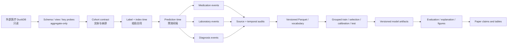

# 共享医疗 DuckDB 项目架构、探表与验证手册

> 文档性质：面向 Agent 和研究人员的长期知识备份 / 新项目启动手册
> 当前实例：DILI-PLUS 住院多重用药与肝损伤风险建模
> 最近核对：2026-08-17（Code-08 Table 1 分阶段查询与零匹配防护）
> 技术真值优先级：当前源码与真实运行产物 > 本文档 > 论文文字或历史脚本

## 1. 为什么需要这份文档

多个研究项目会共享同一个大型医疗 DuckDB，但每个项目的研究问题、结局、预测时点和输入模态可能不同。可复用的不是某个标签或某个模型，而是下面这一整套数据工程方法：

1. 只读连接外部数据库，不把源数据库复制进 Git 仓库；
2. 先识别患者、住院 encounter、业务流水号和表内主键，再做跨表连接；
3. 先定义结局时间、预测时间和数据可用时间，再提取动态特征；
4. 用 aggregate-only 探查和审计证明连接、时间边界和产物合同；
5. 将可变研究假设放入配置，将唯一正式实现放入 `src/`；
6. 为每次真实执行保留命令、Git 状态、随机种子、退出码和日志哈希；
7. 在训练前冻结队列、划分、输入产物与验证证据；
8. 让论文中的每个方法和结果都能反向定位到代码及正式产物。

本文档同时记录：

- **通用规范**：其他共享 DuckDB 项目可以直接采用的架构与检查方法；
- **DILI-PLUS 实例**：已经由当前源码、只读探表或真实审计确认的表接口和实现；
- **不可直接复用的假设**：DILI-PLUS 的结局阈值、时间窗、目标诊断排除和部分连接方式；
- **已知风险**：当前项目中仍需保留警惕、不能包装成数据库天然能力的地方。

这不是 DuckDB 全库的数据字典。任何新项目都必须重新执行轻量只读探查，不得因为表名相同就默认字段含义、粒度、时间语义和覆盖率不变。

## 2. 新 Agent 的推荐阅读顺序

### 2.1 在 DILI-PLUS 中继续工作

1. 先读本文件，理解共享数据库、键、时间和验证方法；
2. 再读 [`PAPER_CODE_ALIGNMENT.md`](PAPER_CODE_ALIGNMENT.md)，了解研究边界和论文—代码映射；
3. 再读 [`REVISION_ROADMAP_PEER_REVIEW.md`](REVISION_ROADMAP_PEER_REVIEW.md)，了解审稿风险、已完成修复和下一阶段；
4. 查看 `git status --short`，不要覆盖尚未提交的用户修改；
5. 查看 `configs/default.yaml`、相关 `src/diliplus/` 模块和最新 manifest；
6. 只有在确认依赖、输入和运行成本后，才执行真实数据库提取或训练。

### 2.2 启动另一个共享 DuckDB 项目

先复制本文档中的架构和检查清单，不要直接复制 DILI 标签或表连接 SQL。新项目至少要新建自己的：

- 研究问题与时间零点说明；
- 数据源合同；
- cohort/label/feature/split/artifact 模块；
- source audit 与 final artifact audit；
- aggregate-only 基线 manifest；
- 论文—代码对应文档。

## 3. 核心原则：先建立合同，再运行模型

所有项目都应把“数据能否用于这个预测任务”分解为五份合同。

| 合同 | 必须回答的问题 | 失败后果 |
|---|---|---|
| 实体合同 | 一行代表患者、一次住院、一次医嘱还是一次检验？ | 跨患者或跨住院污染 |
| 键合同 | 两张表通过哪个经过验证的键连接？连接是否一对一/一对多？ | 行数爆炸、重复、错配 |
| 时间合同 | 哪个时间表示临床发生、记录创建、结果可用或预测时点？ | 看见未来信息、伪早期预警 |
| 标签合同 | 阳性、阴性、排除项和 index time 如何定义？ | 标签漂移或目标泄漏 |
| 产物合同 | 训练、评价和解释读取的是哪个版本、哪个 split、哪个 run？ | 旧结果混入、测试集反复使用 |

模型只应在五份合同都能被机器审计后启动。表面上可以成功运行的 SQL 或 Python 并不等于合同成立。

## 4. 推荐的总体架构



推荐将工作拆成三个层次：

- **源数据层**：外部 DuckDB、表/视图定义、主键与时间字段，只读；
- **研究数据层**：cohort、标签、prediction time、模态序列和 Parquet；
- **实验与论文层**：split、模型 artifact、预测、指标、解释、图表和论文。

三层之间通过带版本和哈希的文件合同连接，不通过“大家都知道这是最新文件”的口头约定连接。

## 5. 当前项目目录职责

```text
configs/                 路径、预测间隔、随机种子和评价协议
pipelines/               按阶段组织的薄执行入口
src/diliplus/            唯一当前实现；业务逻辑应放在这里
src/diliplus/data/       cohort、标签、序列、诊断、词表和数据审计
src/diliplus/training/   模型训练与 checkpoint 生成
src/diliplus/evaluation/ 正式评价
src/diliplus/explainability/ 解释与扰动分析
src/diliplus/reporting/  表格、图片和论文产物
scripts/                 探表、审计、复现验证和 recorded runner
tests/                   小型、确定性、无真实患者数据的合同测试
docs/                    长期知识、论文—代码映射和修订记录
manifests/               可提交的 aggregate-only 基线/协议摘要
data_cache/              患者衍生 Parquet；不进入 Git
vocab/                   数据衍生词表；当前不进入 Git
checkpoints/runs/        按 run/model/fold 保存的正式模型 artifact
reports/runs/            按 run 保存的预测和指标
reports/run_logs/        本地完整命令日志与机器可读运行清单
figures/                 生成图片；一般由代码重建，不进入 Git
archive/legacy/          历史代码；不得作为新工作的实现来源
```

架构约束：

- `pipelines/` 只负责解析参数和调用 `src/`，不要放第二套算法；
- 根目录数字脚本只保留兼容入口，不应产生分叉逻辑；
- 配置中的相对路径必须以项目根目录解析，而不是以当前 shell 目录解析；
- 生成物与源代码分离，避免 Git status 被患者衍生数据、模型和日志淹没；
- `docs/` 记录为什么这样设计，测试和代码记录实际怎样执行。

## 6. 外部 DuckDB 访问合同

### 6.1 当前连接方式

当前实例由 `configs/default.yaml` 配置数据库路径。2026-08-16 基线中的源文件是 `medical.duckdb`，当时大小为 37,306,773,504 bytes。路径和大小只描述当前机器/当前快照，不应写死到其他项目的方法学中。

正式入口是：

```python
from diliplus.config import load_settings
from diliplus.database import connect_source_database

settings = load_settings()
conn = connect_source_database(settings)
try:
    # read-only query
    ...
finally:
    conn.close()
```

`src/diliplus/database.py` 固定调用：

```python
duckdb.connect(str(settings.database_path), read_only=True)
```

并且配置层和连接层都会拒绝 `read_only: false`。新项目应复用这种双重保护。

### 6.2 禁止事项

- 不在源 DuckDB 中创建永久表、索引、视图或 schema；
- 不把 `.duckdb`、Parquet、patient/encounter 明细或模型权重提交到 Git；
- 不将包含原始标识符或逐行病例的探表输出保存到可跟踪文档；
- 不为了方便而绕过统一连接工厂；
- 不把源库文件修改时间当作充分的数据版本证明；
- 不在论文中把管理时间戳自动称为临床事件发生时间。

允许在只读连接内注册内存 DataFrame、读取本地 Parquet，并建立连接级 TEMP TABLE；它们不会写入源数据库，但仍须避免覆盖本地正式产物。

## 7. 已核对的源表/视图接口

下表只列当前代码实际使用或本轮诊断审计确认的接口。字段类型以 2026-08-16 探表结果和当前代码为依据；源库更新后必须重查。

| 关系 | 当前粒度/用途 | 直接使用字段 | 已确认时间或键语义 | 重要边界 |
|---|---|---|---|---|
| `analysis.feature_medication_seq` | encounter 级用药摘要；筛多重用药 cohort | `encounter_id`, `patient_id`, `med_count`, `first_med_time`, `last_med_time` | `encounter_id` 是当前 cohort 锚点 | `med_count >= 5` 是 DILI-PLUS 特定纳入条件 |
| `analysis.feature_medications` | 单次用药事件 | `encounter_id`, `patient_id`, `order_name`, `start_time`; 另有 `order_type`, `source_type` | 通过 `encounter_id` 连 cohort；`start_time` 作事件时间 | 必须重新筛 `start_time < prediction_time` |
| `laboratory_report_sub` | 检验子项事件 | `health_reco`, `class_name`, `result_valu`, `abnormal_st`, `effective_d` | 当前先按 `health_reco` 对齐，`effective_d` 经多格式解析为 `lab_time` | 当前不是已证明的 encounter 精确外键，见第 9 节 |
| `analysis.v_patient_encounters` | encounter 维表 | `encounter_id`, `patient_id`, `visit_number`, `admit_date`, `discharge_date`, `los_days`, `dept_name`, `main_diag_text` | `visit_number` 连接出院摘要的 `business_uu` | 不能用 `patient_id` 代替 encounter 桥 |
| `refined.v_discharge_summary` | 出院摘要/住院桥 | `business_uu`, `inpatient_f`;另有 `health_reco` 等 | `business_uu <- visit_number`; `inpatient_f` 再连诊断 | 一个新项目仍要重查覆盖率和基数 |
| `refined.v_in_medical_record_diag` | 住院诊断事件 | `inpatient_f`, `diagnosis_c`, `diagnosis_n`, `diag_type_c`, `create_time` | `inpatient_f` 锚定同次住院；`create_time` 作保守可用时间代理 | `create_time` 不是已验证的临床诊断 onset |
| `analysis.feature_diagnoses` | encounter 级整理后的诊断行 | `encounter_id`, `patient_id`, `diag_code`, `diag_name`, `diag_type_raw`, `is_primary_diag`, `diag_rank`, `diag_seq_num` | 视图内部使用正确住院桥 | 视图未保留 `create_time`，不能单独支持 prediction-time 过滤 |
| `analysis.feature_diagnosis_seq` | encounter 级诊断汇总 | `encounter_id`, `patient_id`, `primary_diag_name`, `diag_sequence`, `diag_count` | 聚合自 `feature_diagnoses` | 同样缺少逐事件可用时间，当前预测任务没有直接采用 |

### 7.1 诊断的精确住院桥

当前真实审计确认的连接链为：

```text
cohort.encounter_id
  -> analysis.v_patient_encounters.encounter_id
  -> analysis.v_patient_encounters.visit_number
  -> refined.v_discharge_summary.business_uu
  -> refined.v_discharge_summary.inpatient_f
  -> refined.v_in_medical_record_diag.inpatient_f
```

对应 SQL 形态：

```sql
SELECT ...
FROM cohort c
JOIN analysis.v_patient_encounters e
  ON TRIM(CAST(e.encounter_id AS VARCHAR)) = c.encounter_id
JOIN refined.v_discharge_summary b
  ON TRIM(CAST(e.visit_number AS VARCHAR))
   = TRIM(CAST(b.business_uu AS VARCHAR))
JOIN refined.v_in_medical_record_diag d
  ON TRIM(CAST(d.inpatient_f AS VARCHAR))
   = TRIM(CAST(b.inpatient_f AS VARCHAR))
```

不能采用的旧思路是：先从用药视图取得患者号，再用 `health_reco` 连接诊断。患者可能多次住院，这会把其他住院甚至预测之后的诊断带入当前样本。

### 7.2 为什么不能直接使用诊断分析视图

`analysis.feature_diagnoses` 的视图定义已经使用 encounter 桥，因此实体边界优于患者级连接；但它没有保留 `create_time`。在需要“预测时已经可获得”的任务中，只有 encounter 正确还不够，还必须判断诊断记录时间。因此当前正式实现回到 `refined.v_in_medical_record_diag`，同时执行：

```sql
parsed_create_time < prediction_time
```

并排除显式目标诊断。未来如果数据库建立带可靠事件时间的诊断分析视图，可以重新评估，但必须先跑 source audit。

## 8. 标准探表流程

探表的目标不是“找到一个看起来能连上的列”，而是建立可审计的数据源合同。推荐按以下顺序进行。

### 8.1 第一步：发现候选关系

```sql
SELECT DISTINCT table_schema, table_name
FROM information_schema.columns
WHERE LOWER(table_name) LIKE '%diag%'
   OR LOWER(column_name) LIKE '%diagnos%'
ORDER BY table_schema, table_name;
```

对药物、检验、手术、生命体征等模态替换关键词。结果只说明“可能相关”，不说明表可用。

### 8.2 第二步：检查 schema，不打印病例

```sql
DESCRIBE analysis.feature_medications;
DESCRIBE refined.v_in_medical_record_diag;
```

重点记录：

- 字段名和类型；
- 可能的患者键、encounter 键和业务键；
- 候选临床时间、记录时间、修改时间；
- 编码、名称、状态和取消字段；
- raw 表与 refined view 的类型差异。

当前实例中，raw `in_medical_record_diag.create_time` 被探到为 `VARCHAR`，而 refined view 中是 `DOUBLE`。因此不可假定 raw/refined 字段类型相同，也不可只写一个普通 `CAST`。

### 8.3 第三步：查看 view SQL

```sql
SELECT schema_name, view_name, sql
FROM duckdb_views()
WHERE schema_name = 'analysis'
  AND view_name IN ('feature_diagnoses', 'feature_diagnosis_seq');
```

视图定义可以回答：

- 它内部如何桥接；
- 是否已经去重或聚合；
- 是否丢失原始时间字段；
- 排序是否存在稳定 tie-break；
- “primary” 是临床定义还是代码排序结果。

### 8.4 第四步：只做聚合完整性画像

每个候选键/时间至少计算：

- 总行数；
- 非空数和非空比例；
- distinct 数；
- 可解析时间数；
- 最小/最大日期的合理性；
- 重复键数；
- 取消/无效状态数。

禁止把 `SELECT * LIMIT 10` 的真实病例打印到可提交日志。调试确实需要行级值时，应在本地临时查看，不保存、不复制到对话或 Git，并尽快关闭。

### 8.5 第五步：候选键重叠不等于连接成立

需要同时审计：

```text
左侧 distinct key
右侧 distinct key
matched left keys
unmatched left keys
bridge rows
bridge rows / matched left keys
一对多左键数
多对一右键数
连接前后行数放大倍数
```

只报告 `matched_distinct_keys > 0` 远远不够。格式相似的号码可能偶然重叠，也可能代表患者而非 encounter。

### 8.6 第六步：时间字段审计

对于每个候选时间字段，回答：

1. 它表示临床发生、下单、采样、出结果、记录创建、修改还是上传？
2. 数据类型是否混合了时间戳、`YYYYMMDDHHMMSS`、`YYYYMMDD` 和字符串？
3. 时区和 epoch 解析是否会产生固定偏移？
4. 同一事件多个时间字段应使用哪个“当时可获得”时间？
5. 解析失败和不合理日期如何排除并统计？

DILI-PLUS 的通用解析形态是 `TRY_CAST` 加多个 `TRY_STRPTIME`。但新项目必须基于字段真实分布验证格式，不得盲目复制格式列表。

### 8.7 第七步：保存两级审计

- **source audit**：证明源表桥接、覆盖率、时间排除量、目标信息排除量；
- **artifact audit**：证明最终 Parquet 一行一 encounter、数组等长、全部事件早于 prediction time、没有目标泄漏。

两级都应失败即停止，不能仅打印 warning 后继续训练。

## 9. DILI-PLUS 当前的数据处理链

### 9.1 Stage 1：多重用药 cohort 与化验初始对齐

正式实现：`src/diliplus/data/cohort.py`

1. 从 `analysis.feature_medication_seq` 选择 `med_count >= 5`；
2. 要求 `first_med_time`、`last_med_time` 非空；
3. 从 `laboratory_report_sub` 筛选 ALT、AST、总/直接胆红素、ALP、GGT 等名称；
4. 将 `effective_d` 解析为 `lab_time`；
5. 当前按 `health_reco` 连接，并限制在 `first_med_time` 至 `last_med_time + 7 days`；
6. 输出 `data_cache/01_aligned_dili_labs.parquet`。

这里必须保留一个重要边界：化验的初始连接是**患者标识 + 时间窗**，不是已经证明的一次住院精确桥。它在 DILI-PLUS 中产生了后续使用的 encounter-labelled 中间产物，但未来项目不应直接视为最佳实践。更理想的做法是先寻找检验表的 encounter/visit/business 键，并像诊断一样报告精确桥覆盖率；若只能使用患者+时间窗，必须审计住院重叠、事件多重归属和复制率，并在论文限制中说明。

### 9.2 Stage 2：生化代理结局、index time 和 prediction time

正式实现：`src/diliplus/data/labels.py`

DILI-PLUS 当前冻结标签合同：

- 目标化验只考虑 ALT/AST；
- 基线状态正常/低；
- 后续 ALT 或 AST 数值 `>= 120 U/L` 定义 AHI proxy 阳性；
- 阳性 `index_time = t_onset`；
- 阴性在合格用药窗中通过 seeded hash 生成确定性 pseudo-index；
- `prediction_time = index_time - prediction_gap`；
- 当前主分析 gap 为 24 小时；
- 不满足 gap 所需历史窗的 encounter 被排除；
- 修复产物隔离在 `data_cache/prediction_gap_24h/`，不覆盖旧 0h 产物。

这是 DILI-PLUS 特定定义，不是通用 DILI 临床诊断标准。论文应称为 biochemical AHI proxy，不得自动扩大为确诊药物性肝损伤，更不支持因果归因。

### 9.3 Stage 3：药物和化验动态序列

正式实现：`src/diliplus/data/sequences.py`

所有动态事件执行同一上界：

```text
first_med_time <= event_time < prediction_time
```

药物序列：

- 源：`analysis.feature_medications`；
- token：`order_name`；
- 时间：`start_time`；
- 稳定排序：`med_time, med_item`；
- 保存 `med_tokens`, `med_dt_hours`, `med_event_times`。

化验序列：

- 源：Stage 1 的 aligned lab Parquet；
- token/value/time：`lab_item`, numeric `lab_value`, `lab_time`；
- 稳定排序：`lab_time, lab_item, lab_value`；
- 保存 `lab_tokens`, `lab_values`, `lab_dt_hours`, `lab_event_times`。

保留原始事件时间数组非常重要。若只保存 token，后续无法独立证明每个事件是否严格早于 prediction time。

### 9.4 Stage 4：时序泄漏审计

正式实现：`src/diliplus/data/temporal_audit.py`

当前审计至少验证：

- label 与 sequence encounter 一一覆盖；
- encounter 不重复；
- prediction time 晚于首个用药时间；
- 实际 gap 与配置一致；
- 阳性 index time 等于 onset；
- 药物/化验事件没有位于 prediction time 或之后；
- 输入化验中没有目标阈值事件；
- token/value/delta/time 数组长度一致。

2026-08-16 的 24h 真实审计状态为 PASS：46,864 encounters，391 个 AHI-proxy positives，所有上述 violation 均为 0。这个数字是当前数据快照的证据，不是未来运行应硬编码的预期值。

### 9.5 Stage 5：诊断 source audit、构建和 artifact audit

正式实现：

- `src/diliplus/data/diagnosis_audit.py`
- `src/diliplus/data/diagnoses.py`

诊断合同：

1. 使用第 7.1 节的精确住院桥；
2. 解析 `refined.v_in_medical_record_diag.create_time`；
3. 仅保留 `diagnosis_time < prediction_time`；
4. 排除 K71 和名称中显式药物性/毒性肝损伤目标信息；
5. 按 `diagnosis_time, icd_code, diag_name` 稳定排序；
6. 即使 encounter 没有合格诊断，也输出一行空数组；
7. 保存诊断时间数组和合同说明。

2026-08-16 真实 source audit 发现 95,857 条同 encounter、非目标诊断位于 prediction time 或之后；旧实现会让这些记录进入模型。修复后最终产物有 46,864 encounters、216,220 条合格诊断事件，显式目标诊断输入为 0，artifact audit 为 PASS。这说明“时间二次过滤”不是形式检查，而是避免了实质性泄漏。

`create_time` 在此被用作保守的数据可用时间代理。它不能被论文写成诊断实际发生时间，也不能用来建立因果顺序。

### 9.6 Stage 6：词表和模型数据集

正式实现：

- `src/diliplus/data/vocabulary.py`
- `src/diliplus/data/dataset.py`

一般规则：

- 词表排序必须有确定性 tie-break；
- 特殊 token 的 ID 要固定；
- dataset 合并必须验证 encounter 对齐和唯一性；
- 不得让词表构建无意读取测试标签；
- 截断、padding、缺失模态处理和数值标准化必须记录；
- 数据、词表和配置指纹要进入模型 artifact。

### 9.7 Stage 7：Code-08 cohort 描述与 Table 1 查询链

正式实现：`src/diliplus/reporting/table1.py`；唯一论文资产入口：

```powershell
python pipelines/05_build_paper_assets.py --stages table_1
```

`05_build_paper_assets.py` 确实调用 `diliplus.reporting.table1.generate_table_1`。新增
`--stages table_1` 的原因是 Table 1 可以单独重建，不必同时消费尚未由 Code-10 更新的旧性能
结果和图片。

#### 9.7.1 为什么旧查询会中断或得到错误人数

旧 Table 1 把以下逻辑塞进一个大 SQL：旧 `label_dili`、人口学、原始用药、未按
prediction time 过滤的诊断，以及按患者键连接的整张 `laboratory_report_sub`。这会同时产生：

- 标签列名和当前正式 cohort 不一致；
- 论文曾使用的 51,316 条旧 cohort 与当前 24 h 模型 cohort 46,864 条混淆；
- 患者级化验连接到多次住院，形成隐蔽的一对多行膨胀；
- 原始大表扫描和连接导致内存中断；
- 捕获 SQL 异常后函数直接 `return`，上层 pipeline 仍可能看起来正常结束；
- 连接到一个“名称相似”的关系或错误键时可能得到 0 行，但没有 fail-fast。

因此解决方法不是继续猜表名或在同一大 SQL 上补 `DISTINCT`。`DISTINCT` 可能隐藏错误连接，
不能证明实体和时间合同正确。

#### 9.7.2 当前唯一允许的分阶段数据流

| 阶段 | 左侧锚点 | 右侧关系/产物 | 连接键与期望粒度 | 失败条件 |
|---|---|---|---|---|
| 0 cohort anchor | 无 | `prediction_gap_24h/03_dili_dual_stream_tensors.parquet` | 一行一 `encounter_id`；必须有 `label_ahi_proxy` | 0 行、空/重复 encounter、标签不是 `{0,1}`、时间不可解析 |
| 1 诊断 | 正式 cohort | `prediction_gap_24h/03b_diag_tensors.parquet` | `encounter_id` 一对一；诊断已在上游限制为同住院且早于 prediction time | 重复、0 匹配、join 后 N 改变 |
| 2 住院维表 | 上一步 | `analysis.v_patient_encounters` | 规范化后的 `encounter_id`；聚合/去重后仍一行一 encounter | 关系或字段缺失、0 匹配、同 encounter 对应多个 patient |
| 3 人口学 | encounter 映射出的 patient | `analysis.v_patient_profile` | 仅对 demographic dimension 使用 `patient_id` 多对一连接 | 0 匹配、join 后 encounter N 改变；缺失保留并报告 |
| 4 基线化验 | 上一步 | `data_cache/01_aligned_dili_labs.parquet` | 已带 encounter 标签的缓存按 `encounter_id` 聚合后一对一 | 0 匹配、重复 aggregate、join 后 N 改变 |

这里允许 patient key 连接人口学，是因为 patient profile 本来就是患者维表；但 patient key
不能用来连接诊断、用药或化验事件。人口学连接也只能发生在 encounter 已经从正式 cohort
精确映射到 patient 之后。

药物事件数、化验事件数和观察窗直接来自模型实际读取的动态 Parquet，不再重新扫描源库；
合并症标志来自 Code-03 已过滤的诊断 Parquet，不再连接缺少时间字段的
`analysis.feature_diagnoses`；基线 ALT/AST/TBIL 来自定义冻结 cohort 时实际使用的 aligned-lab
缓存，不再为 Table 1 单独发明另一条原始化验连接链。

#### 9.7.3 查询前先验证关系和字段，不猜名字

对每个源关系先执行 schema contract：

```sql
DESCRIBE SELECT * FROM analysis.v_patient_encounters;
DESCRIBE SELECT * FROM analysis.v_patient_profile;
```

当前 Table 1 只直接读取这两个源库关系，必需字段分别是：

```text
analysis.v_patient_encounters:
  encounter_id, patient_id, admit_date, discharge_date, dept_name

analysis.v_patient_profile:
  patient_id, gender, birth_date
```

任何关系不存在或字段缺失都应抛异常。不得自动尝试 `patient_encounter`、
`v_patient_encounter` 等相似名称，也不得在异常后换一个表继续运行。新数据库快照必须重新
DESCRIBE，不能因为本次通过就永久假定 schema 不变。

字段的真实类别也要做 aggregate-only 探查。当前 `gender` 确认存在 `男`、`男性`、`女`、
`女性` 四种值；只映射单字版本会把近半数可用性别误报为缺失。类别探查应输出值和计数，
不得输出 patient ID。

#### 9.7.4 每次 join 必须同时记录的数量

每一步都保存：

```text
left_rows
left_unique_encounters
right_rows
right_unique_encounters
output_rows
output_unique_encounters
matched_left_encounters
unmatched_left_encounters
match_rate
row_inflation = output_rows / left_rows
```

必须满足：

```text
output_rows == left_rows
output_unique_encounters == left_unique_encounters
row_inflation == 1
matched_left_encounters > 0
```

右表在连接前使用代码显式验证一行一 encounter；Pandas 使用
`merge(..., validate="one_to_one")`。若一个合法步骤允许一对多，必须先在右侧聚合到目标粒度，
并在聚合前另存基数审计；不能依赖 join 后 `drop_duplicates` 修补。

2026-08-17 当前快照的真实结果：

| 连接阶段 | 匹配/左侧 | 输出行 | 膨胀系数 |
|---|---:|---:|---:|
| time-bounded diagnosis | 46,864 / 46,864 | 46,864 | 1.000000 |
| encounter dimension | 46,864 / 46,864 | 46,864 | 1.000000 |
| patient profile | 45,639 / 46,864 | 46,864 | 1.000000 |
| aligned baseline labs | 46,864 / 46,864 | 46,864 | 1.000000 |

人口学未匹配的 1,225 个 encounter 保留在 cohort 中并作为缺失报告；不得因为 Table 1 某列
缺失而从模型 cohort 删除病例。最终为 46,864 encounters、46,844 unique patients、391 个
AHI-proxy positives（0.8343%）；20 名患者各有一次额外住院。科室分布证明这是全院住院混合
cohort，不是 ICU-only cohort：名称筛查得到重症/监护相关 447 encounters，其余/未知 46,417。

这些数字属于当前快照，其他项目不得硬编码。

#### 9.7.5 出现患者数为 0 或人数不匹配时的排错顺序

严格按下列顺序定位，不要直接改 SQL：

1. **确认正在读哪个配置和产物。** 打印已解析的 config path、model-data directory、文件存在性、
   Parquet schema、行数和 distinct encounter 数；首先排除读到了旧 0 h/51,316 cohort。
2. **确认左表实体合同。** 检查 `encounter_id` 是否空、是否重复、实际类型；正式 anchor 不是
   patient table，也不是 label-only legacy 文件。
3. **确认源关系精确名称。** 从 `information_schema` 发现候选关系后执行 DESCRIBE/view SQL；
   不根据记忆添加或删除 `analysis.`、`refined.`、单复数或 `v_` 前缀。
4. **规范化但不改变键语义。** 两侧只做 `TRIM(CAST(key AS VARCHAR))`；不能用截断、模糊匹配、
   patient 前缀替代 encounter，或为了提高匹配率拼接多个不同键。
5. **连接前做 distinct overlap。** 计算左右 distinct key 和 inner-join matched distinct key；若为
   0，立即停止。不要用 LEFT JOIN + COALESCE 把 0 匹配伪装成全缺失。
6. **检查 bridge 基数。** 记录每个左键对应右侧 0/1/>1 行的数量；若 >1，先判断这是合法事件
   一对多还是错误跨住院连接。
7. **逐阶段连接。** 每次只加一个关系，比较上节十个指标；从最后一个 PASS stage 和第一个
   FAIL stage 之间定位问题。
8. **最后才计算 Table 1。** 统计函数不得参与实体/键排错；先证明 N 和 grain，再计算中位数、
   比例、缺失、P 值和 SMD。
9. **错误必须传播。** 关系缺失、0 匹配、重复键或 N 改变均以非零退出结束 recorded run；不得
   catch 后只写一行失败日志并返回成功。

#### 9.7.6 基线化验审计的额外警告

当前冻结标签历史实现只按 `lab_time` 排列 ALT/AST，没有为同一时间戳提供稳定的项目/数值
tie-break；同时 Code-02 为保持旧论文 cohort，读取了冻结的 legacy label artifact，而没有重算
标签。Code-08 以当前 aligned-lab 缓存按 `lab_time, lab_item, lab_value` 确定性重建首项后发现：

- AHI-proxy negative 46,473 个中，45,260 个首项状态为正常/低；
- AHI-proxy positive 391 个中，362 个首项状态为正常/低；
- positive 中有 5 个确定性首项数值 `>=120`，但没有“正常/低状态且数值 >=120”的直接冲突。

这不是可以用 Table 1 排版消除的差异。它提示冻结 legacy 标签与当前确定性重建之间存在
同时间并列项/历史规则不完全一致。在 Code-10 正式训练前必须把它作为标签合同决策：要么
保留冻结 cohort 并在论文明确其规则和该审计限制，要么预先定义同时间多项的临床合并规则、
重建标签和全部下游产物。不能看到新性能后再选择方案。

#### 9.7.7 输出和复用

本地 aggregate 输出位于 `reports/p0_08_cohort_table1/`：

```text
table1_characteristics.csv       逐变量显示值、P、SMD、各组 nonmissing/missing
table1_paper.txt                 可人工核对的论文格式
cohort_summary.csv               patients/encounters/prevalence/setting
department_distribution.csv     科室 aggregate 分布
join_audit.csv                   分阶段连接证据
baseline_label_audit.csv         状态/数值一致性审计
source_schema_contract.csv       关系和字段合同
```

可提交的 `manifests/code08_cohort_table1.json` 只含 aggregate counts、合同和输入/输出哈希，
不含 patient/encounter ID。最终执行记录为 `code08-table1-20260817-v3`。新项目可以复用
“schema contract → cohort anchor → one-stage join → cardinality audit → aggregate report”框架，
但不能直接复用本项目的表名、结局、ICD 前缀、实验室中文名称或匹配阈值。

## 10. 时间设计模板

每个预测项目都应先写出下面六个时间定义，再写提取代码。

| 名称 | 定义 | 常见例子 |
|---|---|---|
| `cohort_start` | 样本开始具备资格的时间 | 入院、首剂药物、首次监测 |
| `outcome_time` | 首次满足结局定义的时间 | 首次达到阈值的检验时间 |
| `index_time` | 阳性/阴性用于对齐的参考时间 | 阳性 outcome；阴性匹配或 pseudo-index |
| `prediction_time` | 模型应作出预测的时间 | `index_time - 24h` |
| `event_time` | 事件本身用于排序/过滤的时间 | start/sample/result/create time |
| `availability_time` | 临床系统当时真正能看到该信息的时间 | 结果发布日期、记录创建时间 |

最基本的输入合同通常是：

```text
event availability time < prediction time
```

而不仅是 `clinical event time < outcome time`。例如标本在预测前采集、但结果在预测后返回，则结果值在预测时不可用。

所有边界优先使用严格 `<`，除非研究协议明确说明预测时刻同时发生的事件已经可获得并能被真实系统消费。`<=` 很容易把定义结局的那一条记录带回输入。

### 10.1 阴性样本的 index time

阴性样本没有自然 outcome time。可选方案包括：

- 与阳性按风险窗匹配；
- 在合格观察窗中确定性抽取 pseudo-index；
- 使用预先定义的临床决策时点；
- 使用 landmark analysis 的固定时点。

无论采用哪种，都应：

- 预先定义；
- 保证足够的历史窗口；
- 避免用随运行变化的全局随机状态；
- 保存 seed/规则/source 字段；
- 对合理替代 seed 或时点做敏感性分析。

## 11. 可复现性与运行记录

### 11.1 随机性集中配置

当前项目把不同用途 seed 分开：

- `global_seed`：通用 Python/NumPy/Torch；
- `split_seed`：数据划分；
- `bootstrap_seed`：区间估计；
- `figure_seed`：仅图形抽样/抖动；
- `pseudo_index_seed`：阴性 pseudo-index；
- `pseudo_index_sensitivity_seeds`：预注册敏感性集合。

不同组件使用命名空间派生 seed，避免一次画图改变后续 split。SQL 的 `ORDER BY`、词频并列排序和 Python collection 遍历也必须稳定，否则设置 seed 仍不充分。

### 11.2 Recorded runner

正式命令建议通过 `scripts/run_recorded.py`：

```powershell
python scripts/run_recorded.py `
  --run-id <unique-id> `
  --seed 20260816 `
  -- python <script-and-arguments>
```

它记录：

- 完整命令与 cwd；
- Git commit 和启动时 dirty 状态；
- process seed、`PYTHONHASHSEED`、CUDA workspace 配置；
- UTC 起止时间、持续时间和退出码；
- 合并的 console log；
- log SHA-256；
- 实际 Python 解释器。

本地日志可以被 `.gitignore` 排除；可提交的 manifest 只保留 aggregate counts、协议、哈希和环境摘要，不包含 patient/encounter ID。

### 11.3 数据库快照指纹

大型外部数据库不适合每次计算全文件哈希。最低限度记录：

- 文件名、bytes、mtime；
- 数据库 read-only 状态；
- 关键 schema/view 定义摘要；
- 关键衍生产物哈希；
- aggregate cohort 摘要。

如果数据库有正式发布版本、快照 ID 或数据日期，应优先记录这些稳定标识。文件 mtime 只能作为弱证据。

## 12. 验证体系

推荐采用从便宜到昂贵的验证阶梯。

### 12.1 Level 1：静态/配置合同测试

- 配置相对路径不依赖当前 cwd；
- 数据库写模式被拒绝；
- prediction gap 非负；
- split 比例合法；
- pipeline 阶段顺序固定；
- 旧入口只转发到唯一实现。

### 12.2 Level 2：小型合成数据测试

每个时间和连接合同都要同时有正/负测试。例如：

- prediction time 之前的事件通过；
- 恰好等于 prediction time 的事件失败；
- 目标阈值化验进入输入时失败；
- 显式目标诊断进入输入时失败；
- 四个 split 任意两组有 index/group overlap 时失败；
- artifact 的数据指纹不一致时拒绝加载。

### 12.3 Level 3：真实源数据 aggregate audit

- schema 和 view 定义；
- 键完整性和 bridge coverage；
- join cardinality/explosion；
- 时间解析覆盖率；
- 预测后事件排除量；
- 目标信息排除量；
- 不包含任何逐行标识符。

### 12.4 Level 4：真实最终产物合同审计

- 一行一 encounter；
- label、模态和诊断完全对齐；
- 数组等长；
- 事件时间上界严格；
- 缺失模态以显式空数组/掩码表示；
- 哈希与 manifest 一致。

### 12.5 Level 5：确定性重建

在同一代码、配置和源数据库下至少重建两次，比较：

- 关键 Parquet 哈希或规范化内容哈希；
- cohort aggregate；
- split membership hash；
- 词表哈希；
- 审计 JSON。

若原始 Parquet 文件元数据导致字节哈希变化，可增加内容级规范化哈希，但不能简单忽略差异。

### 12.6 Level 6：训练 artifact smoke test

在小型合成数据上验证：

- 模型状态可保存/加载；
- run、model、fold、split 四方角色齐全；
- selected epoch 和 temperature 齐全；
- raw/calibrated probability 来自同一 logits；
- test logits 不参与温度拟合；
- 下游评价/解释拒绝 run 或数据指纹不匹配。

完成这些后才进入昂贵的正式训练。

## 13. 数据划分和模型产物合同

当前 Code-05/06 提供的可复用模式如下。

### 13.1 四方数据角色

| 角色 | 唯一用途 |
|---|---|
| training | 模型参数拟合 |
| selection | epoch/超参数选择 |
| calibration | 在冻结模型 logits 上拟合正温度 |
| test | 最终一次推理和报告 |

所有角色必须 patient/group 不相交。当前项目 outer 层使用 `StratifiedGroupKFold`，再从 outer-training pool 确定性划出 selection 和 calibration。具体比例和 group 推导是项目配置/数据合同，不是所有项目的固定答案。

### 13.2 Artifact 最低内容

- schema version；
- run ID、model name、fold；
- model state；
- 四方 indices、aggregate summary 和 membership hashes；
- selected epoch/selection criterion；
- calibration temperature；
- 完整配置快照；
- 输入数据、词表和代码实现指纹；
- 生成时间和必要环境信息。

评价、early-warning、attribution 和 perturbation 必须加载同一 artifact，不得下游重新划分、猜 fold 或加载无元数据的裸 `.pth`。

## 14. 隐私与 Git 规则

### 14.1 可以提交

- 源码、测试、配置模板；
- 不含秘密的表/字段合同；
- aggregate counts、比例、hash 和 PASS/FAIL；
- 不含病例标识的 manifests；
- 论文—代码映射与维护记录。

### 14.2 不应提交

- `.duckdb`、`.parquet`、`.pth`、`.pt`、`.joblib`；
- patient/encounter ID 列表；
- 行级病例样例、原始诊断文字或时间线；
- 本地绝对路径作为可移植方法的一部分；
- console 中意外打印的患者明细；
- API token、数据库凭证或个人身份信息。

当前 `.gitignore` 已把主要患者衍生数据、模型、reports 和 figures 排除。新项目仍要在首次运行前检查 ignore，因为一次错误的 `git add -A` 可能把敏感产物加入历史。

## 15. 从当前项目提炼出的常见失败模式

### 15.1 用患者键代替 encounter 键

症状：连接率很高，但一个住院样本出现其他住院的诊断/检查。
处理：寻找 visit/business/inpatient 桥，审计一对多和时间范围。

### 15.2 只验证 encounter，不验证 prediction time

症状：表来自同一次住院，因此误以为安全；实际包含预测后诊断。
处理：保留逐事件 availability-time 字段并执行严格 `< prediction_time`。

### 15.3 使用缺少时间字段的聚合视图

症状：视图方便、整洁，但无法排除未来事件。
处理：查看 view SQL，必要时回到 refined/raw 事件层并重建时间安全视图。

### 15.4 目标化验重新进入输入

症状：模型表现异常高，输入包含定义阳性的同一 ALT/AST 结果。
处理：prediction time 前移；严格上界；artifact audit 检查 threshold lab。

### 15.5 把管理时间当临床 onset

症状：论文声称“诊断发生于”，代码实际用 `create_time`。
处理：写成记录创建/数据可用代理，承认其限制，不作因果解释。

### 15.6 同时间事件排序不稳定

症状：相同 seed 重建后 token 顺序或 Parquet 哈希变化。
处理：`ORDER BY time, token/code, value/name`，每个并列项都给确定性 tie-break。

### 15.7 混合时间格式或 epoch 偏移

症状：出现固定数小时偏移、不合理年代或大量解析失败。
处理：对真实分布逐格式统计；比较 UTC/local；保存解析覆盖率和极值。

### 15.8 捕获异常后继续

症状：前一 stage 失败，pipeline 仍使用旧 Parquet 训练。
处理：核心构建函数抛出异常、非零退出；输出隔离并在成功后原子替换。

### 15.9 反复追加旧结果

症状：不同代码/数据版本的 fold 指标混在一个 CSV。
处理：run-specific 目录；同 run 明确禁止/确认覆盖；manifest 指向唯一输入。

### 15.10 下游重新划分或重新校准

症状：评价与解释的病例不是训练 artifact 对应的 test fold。
处理：split 和 temperature 属于 artifact；下游只消费，不重算。

### 15.11 论文把预测关联写成因果机制

症状：扰动/attribution 被称作药物导致、保护或可安全替换。
处理：仅写模型敏感性、关联或局部预测响应；不涉及未经研究的因果理论。

## 16. 新项目的落地模板

建议沿用下面的编号门，而不是一开始就训练。

### Code-00：冻结项目和数据源基线

- 建立 `src/`、`pipelines/`、`scripts/`、`tests/`、`docs/`、`manifests/`；
- 配置只读 DuckDB；
- 记录 Git commit/dirty、环境、数据库弱指纹和 ignore；
- 写清研究问题、单位、结局和预测时点草案。

### Code-01：只读 schema 与关系探查

- 搜索候选表/视图；
- DESCRIBE；
- 查看 view SQL；
- 画像候选键和时间字段；
- 不保存行级数据。

### Code-02：建立 cohort 和标签合同

- 明确一行的实体；
- 固定纳排和结局；
- 定义阳性/阴性 index time；
- 统计多个 prediction gap 的样本保留率和事件密度。

### Code-03：逐模态建立实体/时间安全提取

- 每个模态独立 source audit；
- 证明同 patient/group、同 encounter、严格预测前；
- 保存事件时间和稳定排序；
- 明确缺失模态处理。

### Code-04：可复现性

- 集中 seeds；
- recorded runner；
- 两次重建；
- aggregate-only baseline manifest；
- pseudo-index/关键随机设计敏感性。

### Code-05：数据划分协议

- 找到真实 patient/group 键；
- training/selection/calibration/test 四方互斥；
- 保存 membership hash；
- 禁止测试集用于 epoch、阈值或 calibration。

### Code-06：模型 artifact 合同

- versioned artifact；
- 配置、split、数据/词表指纹；
- raw/calibrated 同 logits；
- 下游兼容性 guard；
- 合成数据 smoke test。

### Code-07 以后：正式训练、评价与论文资产

只有 Code-00 至 Code-06 全部通过，才启动正式训练。训练后依次完成统计不确定性、校准、子组/敏感性、解释边界、表图和论文同步。

## 17. 通用部分与必须重做部分

| 可直接复用的框架 | 每个新项目必须重新决定/验证 |
|---|---|
| 只读连接工厂 | 具体源表与字段 |
| 配置从项目根解析 | cohort 纳排与分析单位 |
| `src/` + 薄 pipeline | 结局和 prediction time |
| recorded runner | event/availability time 选择 |
| aggregate-only probes/manifests | encounter/visit 桥覆盖率 |
| 时间与数组合同审计 | 模态和目标信息排除 |
| 命名空间 seed | patient/group 键定义 |
| 四方 split 角色 | split 比例和评价指标 |
| versioned artifact guard | 模型、损失和临床解释 |
| 论文—代码双向同步 | 论文能主张到什么程度 |

一句话原则：**复用验证机制，不复用未经重新证明的数据假设。**

## 18. 新 Agent / 新项目接手检查清单

### 数据库与安全

- [ ] 当前数据库路径是否存在，是否只读连接？
- [ ] `.gitignore` 是否排除数据库、Parquet、权重、reports 和标识符文件？
- [ ] 探表输出是否 aggregate-only？
- [ ] 是否知道源库的快照/更新时间？

### 实体与连接

- [ ] 一行样本代表 patient、encounter 还是 event？
- [ ] patient/group/encounter/visit/business 键分别是什么？
- [ ] 每条桥的 matched/unmatched 和 cardinality 是否已审计？
- [ ] 是否检查同患者多次住院和重叠时间窗？

### 时间与标签

- [ ] outcome/index/prediction/event/availability time 是否分别定义？
- [ ] 边界是否严格 `< prediction_time`？
- [ ] 阳性和阴性是否拥有可比较的历史窗？
- [ ] 定义目标的事件和显式目标诊断是否从输入排除？

### 产物与复现

- [ ] 每个 stage 的输入/输出路径和 schema 是否明确？
- [ ] 是否保留逐事件时间用于独立审计？
- [ ] 是否运行正/负合同测试和真实 aggregate audit？
- [ ] 是否有 unique run ID、命令日志、配置快照和哈希？
- [ ] 是否完成两次确定性重建？

### 训练与论文

- [ ] 四方 split 是否 index/group 双重互斥？
- [ ] 模型 artifact 是否绑定 run/fold/data/vocab/config？
- [ ] 测试集是否只做最终推理？
- [ ] 论文的 cohort、时间、模型、数字和图表是否都能定位到证据？
- [ ] 是否避免把预测关联/扰动敏感性写成因果结论？

## 19. 当前项目的证据索引

| 内容 | 代码/证据位置 |
|---|---|
| 只读连接与路径 | `src/diliplus/database.py`, `src/diliplus/config.py`, `configs/default.yaml` |
| cohort 与化验对齐 | `src/diliplus/data/cohort.py` |
| 标签/index/prediction time | `src/diliplus/data/labels.py` |
| 药物/化验序列 | `src/diliplus/data/sequences.py` |
| 时序审计 | `src/diliplus/data/temporal_audit.py` |
| 诊断源审计与桥 | `src/diliplus/data/diagnosis_audit.py` |
| 诊断最终产物 | `src/diliplus/data/diagnoses.py` |
| schema/view/bridge probes | `scripts/probe_diagnosis_schema.py`, `probe_diagnosis_views.py`, `probe_diagnosis_mapping.py` |
| 数据流水线顺序 | `pipelines/01_build_dataset.py` |
| 运行记录 | `scripts/run_recorded.py` |
| 随机性 | `src/diliplus/reproducibility.py` |
| grouped split | `src/diliplus/splits.py`, `manifests/code05_split_protocol.json` |
| artifact/calibration | `src/diliplus/artifacts.py`, `src/diliplus/calibration.py` |
| 基线 manifest | `manifests/code00_code04_baseline.json` |
| 契约测试 | `tests/test_*contract.py`, `tests/test_reproducibility.py` |
| 研究与论文边界 | `docs/PAPER_CODE_ALIGNMENT.md` |
| 审稿修订与执行史 | `docs/REVISION_ROADMAP_PEER_REVIEW.md` |

`reports/` 下的完整真实审计与 run logs 默认不进入 Git；换机器或新克隆后可能不存在。可提交 manifests 与本文件用于说明应如何重建证据，但不能替代真实数据重跑。

## 20. 维护规则

出现以下任一变化时，必须更新本文档的相关部分：

- DuckDB schema、view SQL、字段类型或数据快照变化；
- cohort、标签、prediction gap 或时间字段变化；
- 新增模态或改变 encounter 桥；
- 修改 split、artifact 或目录合同；
- 真实审计推翻本文记录的覆盖率或风险判断；
- 新项目发现可复用的探表脚本、失败模式或验证标准。

更新时应标明日期、证据路径和“通用规范 / 项目特定事实”。不要在本文复制不断变化的全部结果表；详细数值留在 manifest/报告，本文只保留理解架构所需的稳定事实、关键审计结论和入口。

## 21. 给新项目 Agent 的简短接手提示

可以在新项目中直接使用下面这段提示：

> 本项目共享外部医疗 DuckDB。先阅读 DILI-PLUS 的 `docs/DUCKDB_CLINICAL_DATA_ENGINEERING_PLAYBOOK.md`，只复用其只读连接、探表、实体/时间合同、aggregate-only 审计、可复现运行、四方 split 和 artifact 方法。不要复制 DILI-PLUS 的结局、阈值、时间窗或表连接假设。先对当前研究问题重新确认分析单位、patient/encounter/visit/business 键、event/availability time、prediction time 和目标泄漏，再提交数据源合同与 Code-00 至 Code-06 计划；未经 source audit 和 artifact audit 不启动正式训练。
